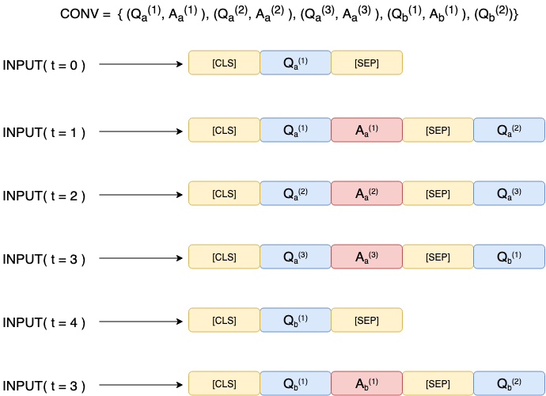
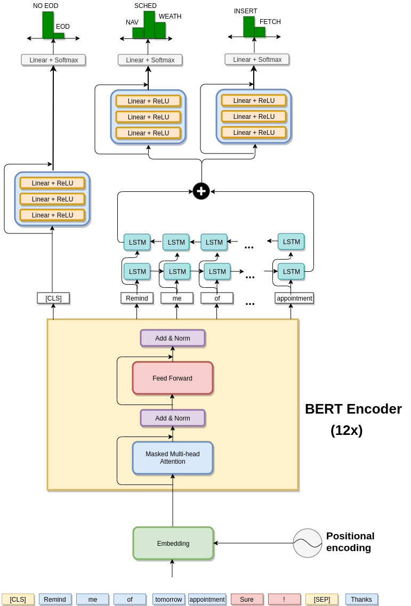
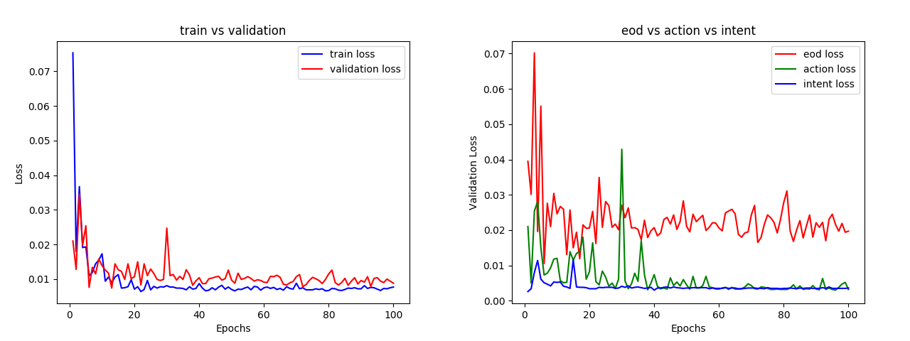

# MTSI-BERT

**MTSI-BERT** is a BERT based joint model for dialogue session classification. It was developed during my master degree thesis at [LINKS Foundation](https://linksfoundation.com/en/) under the supervision of @giusepperizzo.

##### Table of Contents  
[Why](#sec1)  
[Session](#sec2)  
[The Architecture](#sec3) 
[How to use](#sec4) 
[Hyperparamters](#sec5) 
[Dataset](#sec6)  
[Results](#sec7)  
[Dependencies](#sec8) 

<a name="sec1"/>

## Why?
MTSI-BERT goal is to extract information from the session of a multi-turn dialogue. It was developed as a joint model having three main tasks:
  - End of session detection (EOS)
  - Action classification
  - Intent classification
The action is the action that the agent has to perform on a knowledge-base in order to fulfill the user goal and it can be of two types: fetch or insert.

<a name="sec2"/>

## Session
A session is a contiguous ordered sequence of QA pairs in a multi-turn conversational scenario. MTSI-BERT takes as input a triplet of QAQ to understand the existing relation between the previous QA pair and the current Q of the user. In this way it is able to detect the end-of-session.


<a name="sec3"/>

# The Architecture


<a name="sec4"/>

# How to use

## Train
To train the model:
```
python train.py
```
It will save the model dictionary into the folder:
```
savings/<TIMESTAMP>
```
and the plot of the loss into:
```
plots/
```

## Test
To test the model:
```
python test.py
```
Remember to set the path of the saved model to load in the args of the method:
```
def test(load_checkpoint_path):
```

<a name="sec5"/>

## Hyperparameters

| **Parameter** | **Value** |
| :---: | :---: |
| **Mini-batch** | 16 |
| **BERT lr** | 5e-5 |
| **NN lr** | 1e-3 |
| **Weight decay** | 0.1 |
| **Milestones** | 5, 10, 15, 20, 30, 40, 50, 75 |
| **Gamma** | 0.5 |


<a name="sec6"/>

## Dataset

[KVRET](https://nlp.stanford.edu/blog/a-new-multi-turn-multi-domain-task-oriented-dialogue-dataset/)


<a name="sec7"/>

## Results

## Training losses trends



## Test

### End of session
| **Model** | **Precision** | **Recall** | **F1** |
| :---: | :---: | :---: | :---: |
| **MTSI-BERT** | 0.9915 ± 0.0003 | 0.9962 ± 0.0008 | 0.9938 ± 0.0005 |
| **Reference** | 0.9558 ± 0.0016 | 0.9659 ± 0.0003 | 0.9638 ± 0.0006 |

### Action
| **Model** | **Precision** | **Recall** | **F1** |
| :---: | :---: | :---: | :---: |
| **MTSI-BERT** | 1.00 | 1.00 | 1.00 |
| **Reference** | 0.9980 | 0.9895 | 0.9937 |

### Intent
| **Model** | **Precision** | **Recall** | **F1** |
| :---: | :---: | :---: | :---: |
| **MTSI-BERT** | 1.00 | 1.00 | 1.00 |
| **Reference** | 1.00 | 1.00 | 1.00 |


<a name="sec8"/>  

## Dependencies
- Python 3.7.4
- [Transformer package by Hugging Face](https://github.com/huggingface/transformers)
- [spaCy](https://spacy.io/)


Developed by **Matteo A. Senese** with :heart:
